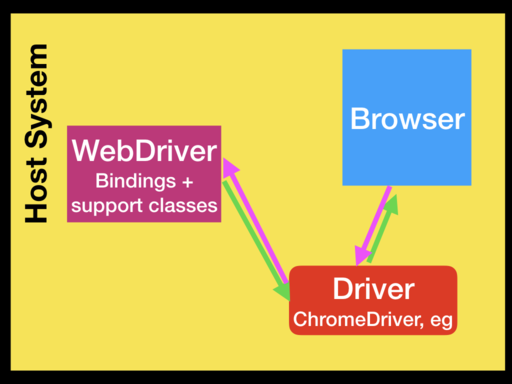

# Testing using SeleniumLibrary

Tatu Aalto: SeleniumLibrary lead developer

Jani Mikkonen: WRITE INTRO HERE

----

# Introduction

SeleniumLibrary: Offers hig level functionality

Selenium: Offer API to interact with browser

Browser driver: ChromeDriver

Browser: Chrome

----

# SeleniumLibrary keywords
- Interact with browser
    - Open Browser, Get Title, Close Browser
- Interact with element
    - Click Button, Page Should Contain Element
- Waiting element  
    - Wait Until Page Contains Element

----

# Exercise 1

- Clone or download: https://github.com/aaltat/SeleniumLibrary-training.git
- Start demo application: `python demoapp/server.py`
- Open browser: [http://localhost:7272/](http://localhost:7272/)
    - username/password: demo/mode 
- Write a simple that tests successful login

----

# Exercise 2

- Write test with different invalid login